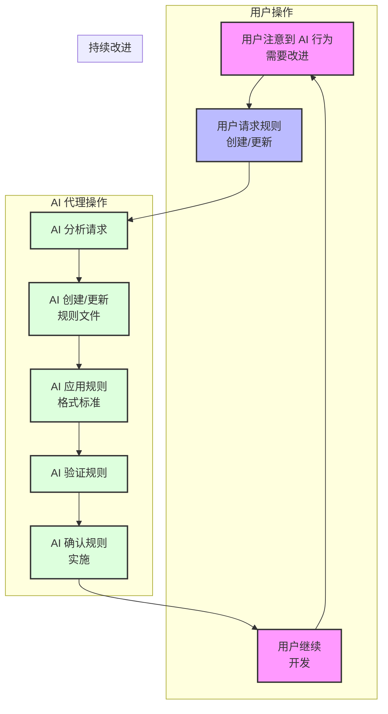

# Cursor 自动规则生成与敏捷工作流模板

[视频演示和详细介绍](https://youtu.be/jEhvwYkI-og) - 更多 Cursor 视频即将推出，如果您喜欢这个视频请订阅！

注意：此项目已在 Claude Sonnet 3.5 上测试 - 其他模型的可靠性可能有所不同。

这是一个用于建立 AI 代理自动生成自我改进精细规则的模板，使用 Cursor 的规则系统。核心理念是用户永远不需要手动创建或更新规则 - 相反，AI 代理通过自然语言请求以一致的格式和风格处理规则创建和维护：

- 确保规则在适当时自动使用
- 根据需要特定使用
- 不会遇到其他规则系统失败时的写入问题

> 💡 **注意：** 有关帮助您以卓越记忆力和一致性管理项目的敏捷-Cursor 工作流系统的完整指南，请参阅 [敏捷工作流文档](docs/agile-readme.md)。

## 关于此模板的重要信息

精细规则和自定义工作流是在编辑器模式下充分利用 AI 的关键 - 通过这个模板，您可以自动生成和维护规则，让您的代理不断改进并从错误中学习。

此模板通过确保规则始终成功创建（在代理创建规则后不会消失），并且始终基于非常清晰简单的前言描述和所需的 glob 模式优化代理自动选择，解决了其他提议的规则生成器的问题。

此外，通过大量研究找到了格式化规则的最佳方式 - 因为有很多竞争和半成熟的理论 - 通过大量研究、挖掘论坛和研究、Claude 提示工程的官方文档、Cline 建议、Reddit 和论坛中的 Cursor 开发者评论，规则将遵循以下一般格式：

- 带有描述和适当 yaml 格式 glob 的前言
- Markdown 格式
- 为特定用例、标注、规则和重点谨慎使用 XML 标签
- Mermaid 流程图或序列图以简洁地驱动 AI 的理解
- 保持规则尽可能简短，同时最大化效果
- 在规则中包含好坏模式的示例，因为这对 AI 代理 LLM 理解规则并正确应用它有很大帮助

## 快速开始 A - 使用敏捷工作流和规则生成器启动新项目！

这将建立一个全新的项目文件夹，其中已有 Cursor 规则和敏捷工作流文档，以及一个启动提示来启动您的新项目的敏捷工作流！

```bash
# 克隆此仓库
git clone https://github.com/bmadcode/cursor-auto-rules-agile-workflow.git
cd cursor-auto-rules-agile-workflow

./apply-rules.sh /path/to/your/project

示例：
./apply-rules.sh ~/projects/my-project
```

脚本将创建项目文件夹（如果不存在），并复制所有规则和文档以开始敏捷工作流！它还将创建 .gitignore 和 .cursorignore 以及一个简单的基础 readme.md 文件，您可以根据需要替换或修改。

## 快速开始 B - 将规则生成器添加到现有项目

如果您想改善在现有项目中使用 Cursor 的体验，可以通过运行以下命令将规则生成器添加到您的项目：

```bash
# 克隆此仓库
git clone https://github.com/bmadcode/cursor-auto-rules-agile-workflow.git
cd cursor-auto-rules-agile-workflow

# 将规则应用到您的项目
./apply-rules.sh /path/to/your/project
```

脚本将：

1. 将所有模板规则复制到您项目的 `.cursor/rules/` 目录
2. 将文档添加到 `docs/workflow-rules.md`
3. 更新 `.gitignore` 以保护私有规则
4. 保留项目中的任何现有规则

就是这样！您的项目现在已配置了我们强大的 AI 工作流系统。

## 概述

此模板通过提供以下功能大幅改善您在编辑器模式下与 AI 的工作方式：

1. **自动化规则生成**：只需告诉 AI 您想要什么行为，它将创建或更新适当的规则。无需手动编写规则！
2. **快速项目设置**：使用预配置的 Cursor 规则立即开始，这些规则建立了 AI 交互的最佳实践。
3. **行为控制**：了解如何利用规则纠正 AI 行为并确保一致的结果。

## 工作流模板和记事本

工作流模板和流程文档现在在两个位置组织，以实现最大灵活性：

1. `.cursor/rules/` - 包含生成格式良好的 AI 的核心规则以及 Markdown 格式规则。
2. `xnotes/` - 包含工作流文档和模板，可与 Cursor 的记事本功能一起使用，以获得更轻量级的方法或应用于 AI 规则。还包含 801-workflow.mdc、901-prd.mdc、902-arch.mdc、903-story.mdc，如果需要，可以选择复制到规则文件夹以尝试使用 Cursor 代理的敏捷内存工作流。此文件夹中的任何内容对于规则生成工作都不是关键的 - 但是为使用 Cursor 代理增量构建的敏捷工作流提供了良好的基础。

### xnotes

这些文件被 Cursor 忽略，因此不会被索引到项目中，也不会被 AI 使用。它们非常适合规划长提示、共享记事本（在 Cursor 设置中启用的测试记事本功能中应用）、起草规则以便在需要时移动到规则文件夹，或者只是不需要索引到项目中的一般注释。

## 规则生成的工作原理



## 入门指南

1. 克隆此仓库或将其用作新项目的模板
2. 确保保留 `.cursor` 目录及其内容
3. 开始使用 AI 代理管理您的规则！

### 规则生成提示示例

以下是与 AI 交互管理规则的一些示例（注意您不必特别说"创建规则"或类似的话 - 只需描述您希望 AI 学习或永不犯错或遗忘的内容，AI 就会为您创建规则）：

- "为 TypeScript 文件注释标准创建规则，以便代理生成的所有 TypeScript 代码都会一致地遵循这一点 - 不要过度注释但也不要注释不足 - 根据需要搜索网络以获得最佳实践，了解何时注释或不注释、什么风格，以及优化注释以供 AI 代理故障排除和理解"
- "创建规则以确保在 TypeScript 文件中正确处理错误"
- "更新测试标准以包含 80% 的覆盖率要求"
- "我注意到您没有遵循我们的命名约定 - 请创建规则来强制执行它们"
- "当前文档格式不一致 - 创建规则来标准化它"
- "导入组织是一团糟！永远不要忘记在 TypeScript 文件中保持导入按组和字母顺序组织"

AI 将自动：

1. 创建/更新适当的规则文件
2. 将其放置在正确位置
3. 遵循所有格式标准
4. 维护版本控制

### 文件组织

AI 在以下结构中维护规则：

- 所有规则必须放置在 `.cursor/rules/` 目录中
- 文件必须使用 `.mdc` 扩展名
- 遵循基于前缀的分类系统：
  - `0XX`：核心规则和标准
  - `1XX`：工具和 MCP 规则
  - `3XX`：测试标准
  - `8XX`：工作流规则
  - `9XX`：模板
  - `1XXX`：特定语言规则
  - `2XXX`：框架/库规则

### 规则文件要求

AI 自动确保所有规则遵循这些标准：

- 必须包含带有描述和 glob 的适当前言
- 必须指定语义版本（MAJOR.MINOR.PATCH）
- 必须使用 Markdown 作为文档和规则的主要格式方法
- XML 标签保留用于特定用例（示例、版本、危险警告）

### 私有与共享规则

- 共享规则：标准命名约定（例如，`000-cursor-rules.mdc`）
- 私有规则：前缀带下划线（例如，`_custom-personality.mdc`）
  - 用于个人偏好
  - 自动 git 忽略
  - 不会影响团队成员
  - 考虑使用记事本而不是个人规则

## 最佳实践

1. **规则创建**：

   - 让 AI 处理规则创建和更新
   - 对您想要强制执行的行为要具体
   - 在请求规则时提供好坏模式的示例

2. **AI 行为控制**：

   - 当您注意到不一致的 AI 行为时，请求规则来纠正它
   - 在请求中使用清晰、描述性的语言
   - 通过查看 AI 的规则实施来验证 AI 的理解

3. **工作流集成**：
   - 从基础模板规则开始
   - 让 AI 随着项目的增长而演化规则
   - 始终使用 AI 进行规则管理以保持一致性

## 贡献

欢迎为基础规则的改进做出贡献或建议新的规则模板。请确保所有贡献都遵循 `000-cursor-rules.mdc` 中建立的标准。

## 许可证

MIT 许可证 